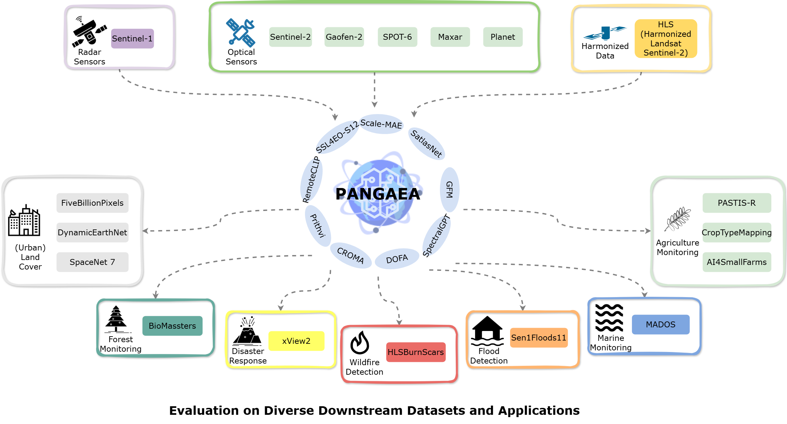

[](https://github.com/yurujaja/geofm-bench/actions/workflows/python-test.yml)

# PANGAEA: A Global and Inclusive Benchmark for Geospatial Foundation Models

## 📚 Introduction

While geospatial foundation models (GFMs) have proliferated rapidly, their evaluations remain inconsistent and narrow. Existing works often utilize suboptimal downstream datasets (e.g., EuroSAT) and tasks (e.g., land cover classification), which constrain comparability and real-world usability. Additionally, a lack of diversity in evaluation protocols, including image resolution and sensor types, further complicates the extensive assessments of GFM performance. 

To bridge this gap, we propose a standardized evaluation protocol that incorporates a wide-ranging selection of datasets, tasks, resolutions, and sensor types, establishing a robust and widely applicable benchmark for GFMs.





In this repo, you can find the code to benchmark GFMs. For the moment we included several GFMs that present different approaches. We look forward to adding new models and datasets.

For the moment, we support the following **models**:

|             | Paper | GitHub | Keywords |
|:-----------:|:-----:|:------:|:--------:|
|  [SSL4EOS12](https://arxiv.org/abs/2211.07044)  | SSL4EO-S12: A Large-Scale Multi-Modal, Multi-Temporal <br> Dataset for Self-Supervised Learning in Earth Observation      | [link](https://github.com/zhu-xlab/SSL4EO-S12) | DINO, MAE, DATA2VEC, MOCO|
|  [Scale-MAE](https://arxiv.org/pdf/2212.14532)  | Scale-MAE: A Scale-Aware Masked Autoencoder for Multiscale Geospatial Representation Learning     | [link](https://github.com/bair-climate-initiative/scale-mae) | Masked Autoencoders, Multiscale|
|  [SatlasNet](https://arxiv.org/pdf/2211.15660)  | SatlasPretrain: A Large-Scale Dataset for Remote Sensing Image Understanding | [link](https://github.com/allenai/satlas/tree/main) | Supervised, Multi-temporal |
|  [GFM](https://arxiv.org/pdf/2302.04476)        | Towards Geospatial Foundation Models via Continual Pretraining | [link](https://github.com/mmendiet/GFM) | Swin, Continual Pre-training |
|  [SpectralGPT](https://arxiv.org/abs/2311.07113) | SpectralGPT: Spectral Remote Sensing Foundation Model      | [link](https://github.com/danfenghong/IEEE_TPAMI_SpectralGPT) | MAE, Multi-spectral |
|  [DOFA](https://arxiv.org/pdf/2403.15356)       | Neural Plasticity-Inspired Multimodal Foundation Model for Earth Observation   | [link](https://github.com/zhu-xlab/DOFA) | MAE, Dynamic bands |
|  [CROMA](https://arxiv.org/pdf/2311.00566)      | CROMA: Remote Sensing Representations with Contrastive Radar-Optical Masked Autoencoders  | [link](https://github.com/antofuller/CROMA) | Contrastive Learning, MAE |
|  [Prithvi](https://arxiv.org/pdf/2310.18660)    | Foundation Models for Generalist Geospatial Artificial Intelligence      | [link](https://github.com/NASA-IMPACT/hls-foundation-os) | MAE, Multi-temporal |
|  [RemoteCLIP](https://arxiv.org/pdf/2306.11029) | RemoteCLIP: A Vision Language Foundation Model for Remote Sensing    | [link](https://github.com/ChenDelong1999/RemoteCLIP) | Contrastive Learning |


And the following **datasets**:

|                     | Download | Domain | Task | Sensors | Location |
|:-------------------:|:--------:|:------:|:----:|:-------:|:--------:|
| [HLS Burn Scars](https://huggingface.co/datasets/ibm-nasa-geospatial/hls_burn_scars) | [link](https://huggingface.co/datasets/ibm-nasa-geospatial/hls_burn_scars) | Wildfire | Semantic Segmentation | HLS (Harmonized Landsat Sentinel-2) | USA |
|        [MADOS](https://www.sciencedirect.com/science/article/pii/S0924271624000625)        |  [link](https://marine-pollution.github.io/index.html)        |  Marine      |  Semantic Segmentation    |    S2   | Global   |
|        [PASTIS-HD](https://arxiv.org/abs/2404.08351)       |    [link](https://huggingface.co/datasets/IGNF/PASTIS-HD)       |   Agriculture     |  Semantic Segmentation    |    S1, S2, SPOT-6  | France   |
|     [Sen1Floods11](http://openaccess.thecvf.com/content_CVPRW_2020/html/w11/Bonafilia_Sen1Floods11_A_Georeferenced_Dataset_to_Train_and_Test_Deep_Learning_CVPRW_2020_paper.html)    | [link](https://github.com/cloudtostreet/Sen1Floods11) |  Flood |Semantic Segmentation  | S1, S2 | Global |
|        [xView2](https://openaccess.thecvf.com/content_CVPRW_2019/html/cv4gc/Gupta_Creating_xBD_A_Dataset_for_Assessing_Building_Damage_from_Satellite_CVPRW_2019_paper.html)       | [link](https://xview2.org/dataset) | HADR | Change Detection | Maxar | Global   |
| [Five Billion Pixels](https://www.sciencedirect.com/science/article/pii/S0924271622003264) |  [original version](https://x-ytong.github.io/project/Five-Billion-Pixels.html) <br> (custom version coming soon)        |  (Urban) Land Cover     |  Semantic Segmentation    |    Gaofen-2     | China    |
|   [DynamicEarthNet](https://arxiv.org/pdf/2203.12560)   |   [link](https://mediatum.ub.tum.de/1650201)        |    (Urban) Land Cover    |   Semantic Segmentation   |   PlanetFusion      | Global   |
|   [CropTypeMapping](https://openaccess.thecvf.com/content_CVPRW_2019/papers/cv4gc/Rustowicz_Semantic_Segmentation_of_Crop_Type_in_Africa_A_Novel_Dataset_CVPRW_2019_paper.pdf) |   [link](https://sustainlab-group.github.io/sustainbench/docs/datasets/sdg2/crop_type_mapping_ghana-ss.html#download) | Agriculture |Semantic Segmentation |S1, S2, Planet|South Sudan|
|      [SpaceNet 7](https://openaccess.thecvf.com/content/CVPR2021/papers/Van_Etten_The_Multi-Temporal_Urban_Development_SpaceNet_Dataset_CVPR_2021_paper.pdf)      |    [link](https://spacenet.ai/sn7-challenge/)      |    Urban    |   Change detection/ <br> Semantic Segmentation   |     Planet    | Global   |
|    [AI4SmallFarms](https://ieeexplore.ieee.org/document/10278130)  | [link](https://doi.org/10.17026/dans-xy6-ngg6)  |  Agriculture     |  Semantic segmentation  |   S2   | Cambodia/Vietnam |
|     [BioMassters](https://papers.nips.cc/paper_files/paper/2023/file/40daf2a00278c4bea1b26cd4c8a654f8-Paper-Datasets_and_Benchmarks.pdf)     |   [link](https://huggingface.co/datasets/nascetti-a/BioMassters)       | Forest       | Regression   |  S1, S2 | Finland   |

The repository supports the following **tasks** using geospatial (foundation) models:
 - [Single Temporal Semantic Segmentation](#single-temporal-semantic-segmentation)
 - [Multi-Temporal Semantic Segmentation](#multi-temporal-semantic-segmentation)
 - [Change Detection](#change-detection)
 - [Single Temporal Regression](#single-temporal-regression)
 - [Multi-Temporal Regression](#multi-temporal-regression)

It is also possible to train some [supervised baselines](#-fully-supervised-baseline), based on UNet.

## 🗺️ Datasets details
Please refer to [**Dataset Guide**](DATASET_GUIDE.md) to understand the processing requirements and commands specific to each dataset.

If you want to fast-prototype your model, maybe you want to run fast experiments on smaller datasets. We suggest starting with MADOS, HLSBurnScars, SpaceNet7 and Sen1Floods11 and AI4SmallFarms. They offer good diversity in satellites and domains. In the future, we will release stratified subsets for each dataset to facilitate fast prototyping across all datasets.

## 🛠️ Setup
Clone the repository:
```
git clone https://github.com/yurujaja/pangaea-bench.git
cd pangaea-bench
```

**Dependencies**

We provide several ways to install the dependencies.

1. **Using either Conda or Mamba**:
    ```
    conda env create -f environment.yaml
    conda activate pangaea-bench
    ```

    Optional: install [Mamba](https://github.com/conda-forge/miniforge/releases/) for faster resolution times
    ```
    wget https://github.com/conda-forge/miniforge/releases/download/24.3.0-0/Mambaforge-24.3.0-0-Linux-x86_64.sh
    sh ./Mambaforge-24.3.0-0-Linux-x86_64.sh

    mamba env create -f environment.yaml
    mamba activate pangaea-bench
    ```

2. **Using pip**, create a Python native virtual environment and install dependencies into it:
   ```
   export PANGAEA_PATH=/path/to/venv/pangaea-bench # change this
   python3 -m venv ${PANGAEA_PATH}
   source ${PANGAEA_PATH}/bin/activate
   
   pip install -r requirements.txt
   ```
 **Then install the code repository as a development package**
   ```
   pip install --no-build-isolation --no-deps -e .
   ```


## 🏋️ Training

To run experiments, please refer to `configs/train.yaml`. In it, in addition to some basic info about training (e.g. `finetune` for fine-tuning also the encoder, `limited_label_train` to train the model on a stratified subset of labels, `num_workers`, `batch_size` and so on), there are 5 different basic configs:
- `dataset`: Information of downstream datasets such as image size, band_statistics, classes etc.
- `decoder`: Downstream task decoder fine-tuning related parameters, like the type of architecture (e.g. UPerNet), which multi-temporal strategy to use, and other related hparams (e.g. nr of channels)
- `encoder`: GFM encoder related parameters. `output_layers` is used for which layers are used for Upernet decoder.  
- `preprocessing`: Both preprocessing and augmentations steps required for the dataset, such as bands adaptation, normalization, resize/crop.
- `task`: Information about the trainer and evaluator. Most of the parameters are overwritten in run. Trainer and evaluator can be used for segmentation (`SegTrainer`) or regression (`RegTrainer`). Different parameter like precision training (`precision`) can be set in it.


Other 3 configs are used to set other training parameters:
- `criterion`: in which you can choose the loss for the training. Consider that if you want to add a custom loss, you should add to `pangaea/utils/losses.py`. Currently, we support `cross_entropy`, `weigthed_cross_entropy`, `dice` and `mae` loss functions.
- `lr_scheduler`: in which you can choose the scheduler. Consider that if you want to add a custom one, you should add to `pangaea/utils/schedulers.py`. 
- `optimizer`: in which you can choose the optimizer. Consider that if you want to add a custom one, you should add to `pangaea/utils/optimizers.py`.


We provide several examples of command lines to initialize different training tasks on single GPU.

Please note:
 - The repo adopts [hydra](https://github.com/facebookresearch/hydra), so you can easily log your experiments and overwrite parameters from the command line. More examples are provided later.
 - To use more gpus or nodes, set `--nnodes` and `--nproc_per_node` correspondingly. Please refer to the [torchrun doc](https://pytorch.org/docs/stable/elastic/run.html).

### 💻 Decoder Finetuning
#### Single Temporal Semantic Segmentation

Take HLSBurnScars dataset, RemoteCLIP Encoder and Upernet Segmentation Decoder as example:
```
torchrun --nnodes=1 --nproc_per_node=1 pangaea/run.py \
   --config-name=train \
   dataset=hlsburnscars \
   encoder=remoteclip \
   decoder=seg_upernet\
   preprocessing=seg_default \
   criterion=cross_entropy \
   task=segmentation
```

If you want to overwrite some parameters (e.g. turn off wandbe, change batch size and the path to the dataset, and use 50% stratified sampled subset for training):
```
torchrun --nnodes=1 --nproc_per_node=1 pangaea/run.py \
   --config-name=train \
   dataset=hlsburnscars \
   encoder=remoteclip \
   decoder=seg_upernet\
   preprocessing=seg_default \
   criterion=cross_entropy \
   task=segmentation \
   dataset.root_path= /path/to/the/dataset/hlsburnscars \
   batch_size=16 \
   use_wandb=False \
   limited_label_train=0.5 \
   limited_label_strategy=stratified
```

#### Multi-Temporal Semantic Segmentation
- Multi-temporal decoder config (e.g. `configs/decoder/seg_upernet_mt_ltae.yaml` if you want to use `ltae` as a strategy to combine multi-temporal info) should be used. 
- In addition, in the dataset config, indicate the number of time frames, e.g., `multi_temporal: 6`

An example of using SSL4EO-DINO on CropTypeMapping is as below
```
torchrun --nnodes=1 --nproc_per_node=1 pangaea/run.py \
   --config-name=train \
   dataset=croptypemapping \
   encoder=ssl4eo_dino \
   decoder=seg_upernet_mt_ltae \
   preprocessing=seg_resize \
   criterion=cross_entropy \
   task=segmentation
```

To use SatlasNet encoder, the `configs/encoder/satlasnet_mi.yaml` is required
```
torchrun --nnodes=1 --nproc_per_node=1 pangaea/run.py \
   --config-name=train \
   dataset=croptypemapping \
   encoder=satlasnet_mi \
   decoder=seg_upernet_mt_ltae decoder.multi_temporal_strategy=null \
   preprocessing=seg_resize \
   criterion=cross_entropy \
   task=segmentation
```


To overwrite parameters, please check the Single Temporal Semantic Segmentation example.

#### Change Detection

One of the change detection decoder should be used: `configs/decoder/seg_siamupernet_conc.yaml` employs feature concatenation strategy while `configs/decoder/seg_siamupernet_diff.yaml` uses feature differencing strategy. For example, Prithvi encoder on xView2:

```
torchrun --nnodes=1 --nproc_per_node=1 pangaea/run.py \
   --config-name=train \
   dataset=xview2 \
   encoder=prithvi \
   decoder=seg_siamupernet_conc \
   preprocessing=seg_default \
   criterion=cross_entropy \
   task=change_detection
```

To overwrite parameters, please check the Single Temporal Semantic Segmentation example.

#### Single Temporal Regression

The regression decoder (e.g. `configs/decoder/reg_upernet.yaml`) and the regression task (e.g. `configs/task/regression.yaml`) configs should be used. 
E.g. Prithvi encoder on BioMassters

```
torchrun --nnodes=1 --nproc_per_node=1 pangaea/run.py \
   --config-name=train \
   dataset=biomassters \
   encoder=prithvi \
   decoder=reg_upernet \
   preprocessing=reg_default \
   criterion=mse \
   task=regression
```
To use SatlasNet encoder, the `configs/encoder/satlasnet_si.yaml` is required.
To overwrite parameters, please check the Single Temporal Semantic Segmentation example.

#### Multi-Temporal Regression

The multi-temporal regression decoder (e.g. `configs/decoder/reg_upernet_mt_ltae.yaml` or `configs/decoder/reg_upernet_mt_linear.yaml`) and the regression task (e.g. `configs/task/regression.yaml`) configs should be used. 

Take Prithvi encoder on BioMassters as example:

```
torchrun --nnodes=1 --nproc_per_node=1 pangaea/run.py \
   --config-name=train \
   dataset=biomassters \
   encoder=prithvi \
   decoder=reg_upernet_mt_ltae \
   preprocessing=reg_default \
   criterion=mse \
   task=regression
```

To use SatlasNet encoder, please refer to the multi-temporal semantic segmentation example.
To overwrite parameters, please check the Single Temporal Semantic Segmentation example.

### 💻 End-to-end Finetuning

It is enough to add `finetune=True` to the command line.

For example, for single-temporal semantic segmentation:
```
torchrun --nnodes=1 --nproc_per_node=1 pangaea/run.py \
   --config-name=train \
   dataset=hlsburnscars \
   encoder=remoteclip \
   decoder=upernet\
   preprocessing=default \
   criterion=cross_entropy \
   task=segmentation \
   finetune=True
```

### 💻 Fully Supervised Baseline 

The repo supports also training fully supervised baselines (e.g. UNet). To run these, follow the same command line rules as for other models. Keep in mind that setting finetune=True is necessary since this fully supervised approach trains the model from scratch. 
An example for single temporal semantic segmentation is provided (Sen1Floods11 dataset):
```
torchrun --nnodes=1 --nproc_per_node=1 pangaea/run.py \
   --config-name=train \
   dataset=sen1floods11 \
   encoder=unet_encoder \
   decoder=seg_unet \
   preprocessing=seg_default \
   criterion=cross_entropy \
   task=segmentation \
   finetune=True
```
For the moment, there is no multi-temporal baseline supported.

## 🔧 Customization

### Using Your Own Dataset

Refer to: [Adding a new downstream dataset](.github/CONTRIBUTING.md#adding-a-new-downstream-dataset)

### Using Your Own Model

Refer to: [Adding a new geospatial foundation model](.github/CONTRIBUTING.md#adding-a-new-geospatial-foundation-model)

## 🏃 Evaluation 

An evaluation step is always run after the training.

If you want to just run an evaluation, indicate the `ckpt_dir` where the checkpoints and configurations are stored.

```
torchrun pangaea/run.py --config-name=test ckpt_dir=path_to_ckpt_dir
```

## ✏️ Contributing
We appreciate all contributions. Please refer to [Contributing Guidelines](.github/CONTRIBUTING.md).

## ⚠️ Warnings

Some features are under construction:
 - the automatic download is working for all the datasets and models' weights but, respectively, **Five Billion Pixels**, **BioMassters**, and **GFM**.


## 🧮 Some first results

A pre-print is coming soon... Stay tuned!

| Encoder | Dataset       | Epochs | mIoU   |
|---------|---------------|--------|--------|
| Prithvi | MADOS         | 80     | 53.455 |
| Prithvi | HLSBurnScars  | 80     | 86.208 |
| Prithvi | Sen1Floods11  | 80     | 87.217 |
| Prithvi | AI4SmallFarms | 80     | 33.796 |

NOTE: if you want to benchmark the results of your model, for a fair comparison do not change the hparams in the configs! When the pre-print will be out, we will publish also a set of "benchmark-configs".

## 📝 Citation

If you use this software in your work, please cite:

```
@misc{pangaea,
  author = {Pangaea Team},
  title = {Pangaea},
  year = {2024},
  publisher = {GitHub},
  journal = {GitHub repository},
  howpublished = {\url{https://github.com/yurujaja/pangaea-bench}},
}
```
